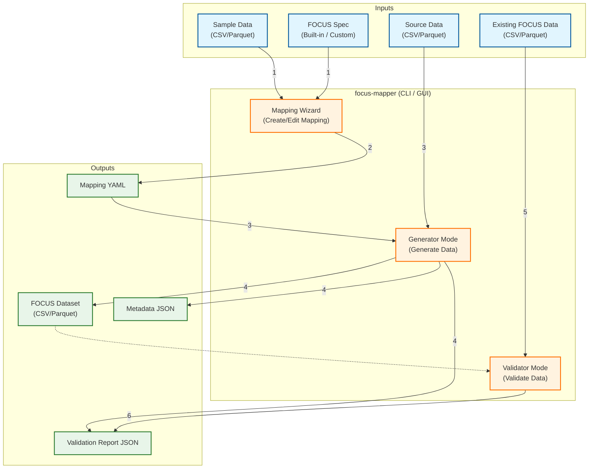

# focus-mapper


[](https://codecov.io/gh/quickwind/focus-mapper)

Generate FinOps FOCUS compliant reports from a pre-flattened billing data.

This project takes any tabular data (CSV/Parquet) and converts it to a FOCUS compliant report using a YAML mapping.
You can build mappings via:
- CLI mapping wizard (interactive prompts)
- Desktop GUI (for managing mappings and running generation/validation with previews


## Table of Contents

- [General Description](#general-description)
- [Functionalities](#functionalities)
- [Architecture](#architecture)
- [Usage](#usage)
  - [Install](#install)
  - [What You Need](#what-you-need)
  - [Generate (CLI)](#generate-cli)
  - [Validate (CLI)](#validate-cli)
  - [Mapping Wizard (CLI)](#mapping-wizard-cli)
  - [Desktop GUI (Tkinter)](#desktop-gui-tkinter)
  - [Use as a Library](#use-as-a-library)
  - [High-Level API (Recommended)](#high-level-api-recommended)
  - [Return Types](#return-types)
  - [Exported Types](#exported-types)
  - [Low-Level API](#low-level-api)
- [Tech Details](#tech-details)
  - [Supported Spec Versions](#supported-spec-versions)
  - [Populate Spec Versions](#populate-spec-versions)
  - [External Spec Directory (Dev/Test Only)](#external-spec-directory-devtest-only)
  - [Data Generator Configuration](#data-generator-configuration)
  - [v1.3 Metadata Support](#v13-metadata-support)
  - [Mapping YAML Specification](#mapping-yaml-specification)
  - [Tests](#tests)
  - [Building for Windows](#building-for-windows)

## General Description

`focus-mapper` turns a “source” dataset (your billing reports data) into a FOCUS dataset by applying a mapping YAML.
It can also validate an existing FOCUS dataset and produce a validation report.

## Functionalities

- Generate FOCUS dataset from source (CSV/Parquet) + mapping (YAML) with sidecar metadata and validation report output.
- Validate an existing FOCUS dataset.
- Validate mapping YAML before using it (catch config/spec issues early).
- Build mappings interactively via the CLI wizard.
- Manage/edit mappings and generate datasets via a Tkinter desktop GUI:
  - Mapping list table with status and quick actions
  - Mapping editor with spec-aware column help, operation configuration, previews, and validation configuration UI
  - Generator output preview (first 100 rows), logs/progress, and a validation report viewer
  - Persistent settings (e.g., external spec directory for dev/testing)

## Architecture



## Usage

### Install

```bash
pip install focus-mapper

# With Parquet support
pip install "focus-mapper[parquet]"

# Force Pandas 1.5 (legacy support)
pip install "focus-mapper[pandas15]"

focus-mapper --help
```

### What You Need

- A flat input table (CSV or Parquet).
- A mapping YAML that tells the tool how to create each FOCUS column.

If you don't have a mapping yet, start with the wizard.

### Generate (CLI)

```bash
python -m focus_mapper generate \
  --input telemetry.csv \
  --mapping mapping.yaml \
  --output focus.csv \
  --metadata-out focus.focus-metadata.json \
  --validation-out focus.validation.json
```

Notes:
- `--spec` is optional; by default the spec version comes from the mapping YAML.

Outputs:
- `focus.csv` (FOCUS report)
- `focus.focus-metadata.json` (metadata)
- `focus.validation.json` (validation report)

### Validate (CLI)

```bash
python -m focus_mapper validate \
  --spec v1.2 \
  --input focus.csv \
  --out focus.validation.json
```

### Mapping Wizard (CLI)

Interactive wizard to create a mapping YAML based on a sample input file:

```bash
focus-mapper-wizard \
  --spec v1.2 \
  --input telemetry.csv \
  --output mapping.yaml
```

You can also run the wizard with no arguments and it will prompt for values:

```bash
focus-mapper-wizard
```

Optional flags:
- `--include-recommended` to include Recommended columns
- `--include-conditional` to include Conditional columns
- `--include-optional` to include Optional columns

Tip: column name prompts support tab‑completion (case‑insensitive).
The wizard will also show a summary of default validation settings and let you override them globally or per column.
For standard FOCUS columns, the wizard does not offer a `cast` option because the generator will coerce to the spec type automatically.

### Desktop GUI (Tkinter)

Launch the GUI:

```bash
python -m focus_mapper.gui.main
```

If Tkinter isn’t installed:
- macOS (Homebrew): `brew install python-tk`
- Linux (Debian/Ubuntu): `sudo apt-get install python3-tk`
- Windows: reinstall Python and ensure “tcl/tk and IDLE” is checked

### Use as a Library

Install from PyPI:

```bash
pip install focus-mapper
```

### High-Level API (Recommended)

The library provides three main entrypoint functions:

```python
from focus_mapper import generate, validate, validate_mapping

# Generate FOCUS data from input + mapping
result = generate(
    input_data="telemetry.csv",           # Path or DataFrame
    mapping="mapping.yaml",                # Path or MappingConfig
    output_path="focus.parquet",           # Output file path
    spec_version="v1.3",                   # Optional, defaults to mapping version
    dataset_instance_complete=True,        # v1.3+ metadata
    generator_name="my-tool",              # Custom generator name
    generator_version="2.0.0",             # Custom generator version
)

if result.is_valid:
    print(f"Generated {len(result.output_df)} rows")
else:
    print(f"Validation errors: {result.validation.summary.errors}")

# Validate existing FOCUS data
report = validate(
    data="focus.parquet",                  # Path or DataFrame
    spec_version="v1.3",
    output_path="validation.json",
    write_report=True,
)

for finding in report.findings:
    if finding.severity == "ERROR":
        print(f"Error in {finding.column}: {finding.message}")

# Validate mapping YAML before use
mapping_result = validate_mapping("mapping.yaml")

if not mapping_result.is_valid:
    for error in mapping_result.errors:
        print(f"Error: {error}")
```

### Return Types

| Function | Returns |
|----------|---------|
| `generate()` | `GenerationResult` with `output_df`, `validation`, `metadata`, `is_valid` |
| `validate()` | `ValidationReport` with `findings`, `summary` |
| `validate_mapping()` | `MappingValidationResult` with `is_valid`, `errors`, `warnings`, `mapping` |

### Exported Types

```python
from focus_mapper import (
    # Main API functions
    generate, validate, validate_mapping,
    # Result types
    GenerationResult, MappingValidationResult, ValidationReport,
    ValidationFinding, ValidationSummary, SidecarMetadata,
    # Config types
    MappingConfig, FocusSpec,
    # Loaders
    load_mapping_config, load_focus_spec,
)
```

### Low-Level API

For more control, use the individual modules:

```python
from pathlib import Path
import pandas as pd

from focus_mapper.mapping.config import load_mapping_config
from focus_mapper.mapping.executor import generate_focus_dataframe
from focus_mapper.spec import load_focus_spec
from focus_mapper.validate import validate_focus_dataframe
from focus_mapper.metadata import build_sidecar_metadata, write_sidecar_metadata

df = pd.read_csv("input.csv")
mapping = load_mapping_config(Path("mapping.yaml"))
spec = load_focus_spec("v1.2")

out = generate_focus_dataframe(df, mapping=mapping, spec=spec)
report = validate_focus_dataframe(out, spec=spec, mapping=mapping)
```

Notes:
- Parquet support requires `pyarrow` (`pip install "focus-mapper[parquet]"`).
- Supported specs: `v1.1`, `v1.2`, and `v1.3`. `v1.0` is not supported.
- Validation overrides require passing `mapping` to `validate_focus_dataframe`.

## Tech Details

### Supported Spec Versions

Default spec version is `v1.3`. Supported versions are `v1.1`, `v1.2`, and `v1.3`. `v1.0` is not supported.

### Populate Spec Versions

Use the tool below to download and store a specific spec version from the upstream repository:

```bash
python tools/populate_focus_spec.py --version 1.1
python tools/populate_focus_spec.py --version 1.2
python tools/populate_focus_spec.py --version 1.3
```

If a version tag doesn't exist, override the git ref:

```bash
python tools/populate_focus_spec.py --version 1.2 --ref main
```

Then use `--spec v1.2` (or `v1.1`, `v1.3`) in the CLI.

### External Spec Directory (Dev/Test Only)

You can override bundled specs with custom JSON files for testing or spec development (not recommended for production use).

**Directory format:**
```
/path/to/specs/
├── focus_spec_v1.1.json    # Override v1.1
├── focus_spec_v1.2.json    # Override v1.2
└── focus_spec_v1.3.json    # Override v1.3 (use as many as needed)
```

**Usage options (in priority order):**

```bash
# 1. CLI flag (highest priority)
focus-mapper generate --spec v1.3 --spec-dir /path/to/specs ...

# 2. Environment variable
export FOCUS_SPEC_DIR=/path/to/specs
focus-mapper generate --spec v1.3 ...

# 3. Library API
from focus_mapper import load_focus_spec
spec = load_focus_spec("v1.3", spec_dir="/path/to/specs")
```

GUI note:
- The GUI Settings screen persists `spec_dir` to `~/.focus_mapper/settings.json` and sets `FOCUS_SPEC_DIR` for the current process.

If a version isn't found in the external directory, it falls back to bundled specs.

### Data Generator Configuration

You can customize the `DataGenerator` metadata field (used in v1.3+) using environment variables. This is useful when wrapping `focus-mapper` in another tool.

**Environment Variables:**

- `FOCUS_DATA_GENERATOR_NAME`: Override the generator name (default: `focus-mapper`)
- `FOCUS_DATA_GENERATOR_VERSION`: Override the generator version (default: library version)

**Priority Order:**

1. Explicit arguments (CLI `--data-generator` or API `generator_name`)
2. Environment variables
3. Default values

### v1.3 Metadata Support

For v1.3 datasets, the library generates the new collection-based metadata structure:

```json
{
  "DatasetInstance": [{ "DatasetInstanceId": "...", "DatasetInstanceName": "...", "FocusDatasetId": "CostAndUsage" }],
  "Recency": [{ "DatasetInstanceId": "...", "DatasetInstanceComplete": true, "TimeSectors": [...] }],
  "Schema": [{ "SchemaId": "...", "FocusVersion": "1.3", "ColumnDefinition": [...] }],
  "DataGenerator": { "DataGenerator": "focus-mapper" }
}
```

Key v1.3 features:
- **TimeSectors**: Per-period completeness tracking for CostAndUsage datasets
- **DatasetInstanceComplete**: Overall dataset completeness flag
- **DatasetInstanceId**: Deterministic hash for dataset identification

### Mapping YAML Specification

The mapping file is a YAML document that defines how your input columns are transformed into FinOps FOCUS compliant columns.

#### Core Concept: The Pipeline
Each column in the `mappings` section is defined as a series of **steps**. Steps are executed in order, and the output of one step is passed as the input to the next.

#### Top-level Structure
```yaml
spec_version: "1.2"
creation_date: "2026-02-07T09:00:00Z"  # v1.2+: ISO8601 timestamp
dataset_type: "CostAndUsage"            # v1.3+: CostAndUsage or ContractCommitment
dataset_instance_name: "My Report"      # v1.3+: Human-readable name

validation:
  default:
    mode: permissive
    datetime:
      format: null
    decimal:
      precision: null
      scale: null
      integer_only: false
      min: null
      max: null
    string:
      min_length: null
      max_length: null
      allow_empty: true
      trim: true
    json:
      object_only: false
    allowed_values:
      case_insensitive: false
    nullable:
      allow_nulls: null
    presence:
      enforce: true
mappings:
  # Standard FOCUS column name
  BilledCost:
    description: "Optional documentation for metadata"
    steps:
      - op: from_column
        column: "raw_cost"
      - op: cast
        to: "decimal"
        scale: 2
    validation:
      decimal:
        precision: 12
        scale: 2
        min: 0
```

#### Validation Overrides (Optional)

Validation is **permissive by default** unless you define `validation.default`. You can override validation for individual columns inside each mapping:

```yaml
spec_version: "1.2"
validation:
  default:
    mode: permissive
    datetime:
      format: null
    decimal:
      precision: null
      scale: null
      integer_only: false
      min: 0
      max: null
    string:
      min_length: null
      max_length: 120
      allow_empty: true
      trim: true
    json:
      object_only: false
    allowed_values:
      case_insensitive: false
    nullable:
      allow_nulls: null
    presence:
      enforce: true
mappings:
  BillingPeriodStart:
    steps:
      - op: sql
        expr: "TRY_CAST(billing_period || '-01' AS TIMESTAMPTZ)"
      - op: cast
        to: datetime
    validation:
      mode: strict
      datetime:
        format: "%Y-%m-%dT%H:%M:%SZ"
  BilledCost:
    steps:
      - op: from_column
        column: billed_cost
    validation:
      decimal:
        precision: 12
        scale: 2
        min: 0
  Tags:
    steps:
      - op: from_column
        column: tags_json
    validation:
      json:
        object_only: true
```

Validation override keys:
- `mode`: `permissive` or `strict`
- `datetime.format`: strftime format; if omitted, permissive uses inference
- `decimal`: `precision`, `scale`, `integer_only`, `min`, `max`
- `string`: `min_length`, `max_length`, `allow_empty`, `trim`
- `json.object_only`: require JSON objects only
- `allowed_values.case_insensitive`: case‑insensitive matching (default: false)
- `nullable.allow_nulls`: override spec nullability
- `presence.enforce`: skip "missing column" checks

#### Validation Severity by Feature Level

Missing column validation severity is determined by the column's feature level:

| Feature Level | Severity | Finding Generated? |
|---------------|----------|-------------------|
| Mandatory | ERROR | Yes |
| Recommended | WARN | Yes |
| Conditional | INFO | Yes |
| Optional | - | No |

#### Example Input (CSV)

```csv
billing_period,billing_date,billing_hour,billing_currency,billed_cost,tax_amount,charge_category,charge_class,charge_description,alt_description,tag_a,tag_b,pricing_quantity,pricing_unit
2026-01,2026-01-30,4,USD,12.34,1.23,Usage,Normal,Compute usage,,core,vm,1,Hours
2026-01,2026-01-30,5,USD,5.00,0.50,Tax,Normal,Sales tax,Alt tax desc,billing,tax,1,Hours
```

#### Example Mapping (YAML)

```yaml
spec_version: "1.2"
mappings:
  BillingPeriodStart:
    steps:
      - op: pandas_expr
        expr: 'pd.to_datetime(df["billing_period"] + "-01", utc=True)'
      - op: cast
        to: datetime

  BillingPeriodEnd:
    steps:
      - op: pandas_expr
        expr: 'pd.to_datetime((df["billing_period"].str.slice(0,4).astype(int) + ((df["billing_period"].str.slice(5,7).astype(int) + 1) > 12).astype(int)).astype(str) + "-" + (((df["billing_period"].str.slice(5,7).astype(int) + 1 - 1) % 12) + 1).astype(str).str.replace(r"^(\\d)$", r"0\\1", regex=True) + "-01", utc=True)'
      - op: cast
        to: datetime

  ChargePeriodStart:
    steps:
      - op: sql
        expr: "TRY_CAST(billing_date || 'T' || LPAD(CAST(billing_hour AS VARCHAR), 2, '0') || ':00:00Z' AS TIMESTAMPTZ)"
      - op: cast
        to: datetime

  ChargePeriodEnd:
    steps:
      - op: sql
        expr: "TRY_CAST(billing_date || 'T' || LPAD(CAST(billing_hour AS VARCHAR), 2, '0') || ':00:00Z' AS TIMESTAMPTZ) + INTERVAL 1 HOUR"
      - op: cast
        to: datetime

  EffectiveCost:
    steps:
      - op: pandas_expr
        expr: "df['billed_cost'] + df['tax_amount']"
      - op: cast
        to: decimal
        scale: 2

  x_TagConcat:
    description: "Concat tag_a and tag_b"
    steps:
      - op: concat
        columns: ["tag_a", "tag_b"]
        sep: "-"
```

#### Operation Reference

| Operation | Description | Parameters | Example |
|-----------|-------------|------------|---------|
| `from_column` | Initialize the pipeline from a source column. Use this as the first step when you want to transform an input field. | `column` (string; input column name) | `- op: from_column`<br>`  column: "cost"` |
| `const` | Create a column with the same value for every row (including `null`). Useful for static metadata. | `value` (any) | `- op: const`<br>`  value: "Acme"` |
| `null` | Create a column filled with null values. Use quoted `"null"` in YAML. | (none) | `- op: "null"` |
| `coalesce` | Pick the first non-null value across multiple columns, left to right. | `columns` (list of strings) | `- op: coalesce`<br>`  columns: ["a", "b"]` |
| `map_values` | Replace values using a lookup dictionary. If a value is missing, use `default` (or null if not set). Can start from `column` or the current series. | `mapping` (dict), `default` (optional), `column` (optional) | `- op: map_values`<br>`  column: "charge_category"`<br>`  mapping: {"Usage": "U", "Tax": "T"}` |
| `concat` | Join multiple columns into a single string. Nulls are treated as empty strings. | `columns` (list), `sep` (string, default "") | `- op: concat`<br>`  columns: ["tag_a", "tag_b"]`<br>`  sep: "-"` |
| `cast` | Convert the current series to a specific type. Use `decimal` for money and `datetime` for timestamps. | `to` (string: `string|float|int|datetime|decimal`), `scale` (int, decimal only), `precision` (int, decimal only) | `- op: cast`<br>`  to: "decimal"`<br>`  scale: 2`<br>`  precision: 12` |
| `round` | Round the current numeric series to `ndigits`. | `ndigits` (int, default 0) | `- op: round`<br>`  ndigits: 2` |
| `math` | Row-wise arithmetic across columns or constants. Supports `add`, `sub`, `mul`, `div`. Use `operands` to list inputs. | `operator` (string), `operands` (list of `{column}` or `{const}`) | `- op: math`<br>`  operator: add`<br>`  operands: [{column: "cost"}, {column: "tax"}]` |
| `when` | Conditional assignment: if `column == value` then `then`, else `else`. | `column`, `value`, `then`, `else` (optional) | `- op: when`<br>`  column: "charge_category"`<br>`  value: "Tax"`<br>`  then: "Y"`<br>`  else: "N"` |
| `sql` | **Recommended.** Execute a DuckDB SQL expression. Cleaner syntax and better performance than `pandas_expr`. Use column names directly. | `expr` (string) or `query` (full SQL) | `- op: sql`<br>`  expr: "a + b"` |
| `pandas_expr` | Evaluate a safe pandas expression. Use `df` for the input DataFrame, `current` for the prior series, and `pd` for pandas helpers. Must return a Series or scalar. | `expr` (string) | `- op: pandas_expr`<br>`  expr: "df['a'] + df['b']"` |


#### Automatic Dry-Run for sql and pandas_expr

When defining `sql` or `pandas_expr` steps in the wizard, you get a **real-time preview**:
- **Live Dry-Run**: Try applying it for first 100 rows of input.
- **Instant Feedback**: Shows first 5 result values on success, or error details on failure.

#### sql Operation (Recommended)

The `sql` operation uses DuckDB SQL and is recommended over `pandas_expr` for:
- Cleaner, more readable syntax
- Better performance on large datasets
- Familiar SQL semantics

```yaml
# Arithmetic
EffectiveCost:
  steps:
    - op: sql
      expr: "billed_cost + tax_amount"

# Date/time with INTERVAL
ChargePeriodEnd:
  steps:
    - op: sql
      expr: "TRY_CAST(billing_date || 'T00:00:00Z' AS TIMESTAMPTZ) + INTERVAL 1 HOUR"

# Conditional (CASE)
x_IsTax:
  steps:
    - op: sql
      expr: "CASE WHEN charge_category = 'Tax' THEN 'Y' ELSE 'N' END"

# Full Query Mode
# Use 'query' for complex SQL involving aggregations or window functions.
# You must SELECT from the 'src' table and return a single column.
x_RunningTotal:
  steps:
    - op: sql
      query: "SELECT SUM(billed_cost) OVER (PARTITION BY billing_account_id ORDER BY billing_date) FROM src"
```

**Safety Note:** `sql` queries must start with `SELECT` or `WITH` to ensure read-only operations.

**Warning:** Using `ORDER BY` in your query (or within window functions) may change the row order of the result relative to the input DataFrame. Ensure your validation and logic accounts for potential row reordering if you rely on index alignment.

See [DuckDB SQL docs](https://duckdb.org/docs/sql/introduction) for available functions.

#### pandas_expr Safety Notes

`pandas_expr` is evaluated in a restricted environment:
- Available names: `df`, `pd`, `current`, `str`, `int`, `float`
- No builtins, no private/dunder attribute access
- Only a safe allowlist of pandas methods is permitted

If you need more pandas methods, add them to the allowlist in `src/focus_mapper/mapping/ops.py`.

#### Extension Columns
Custom columns MUST start with the `x_` prefix. They will be appended to the output dataset and documented in the generated metadata if a `description` is provided.

#### Skip a Column
If you skip a column in the wizard, it will not be mapped and will remain null in the output.

### Tests

```bash
pytest
```

Coverage is enabled by default. HTML report is written to `htmlcov/index.html`.

GUI tests:
- GUI tests use Tk and run behind a guard: set `RUN_GUI_TESTS=1` to enable them locally.
- In CI on Linux, tests run under `xvfb` so Tk can run headlessly.

### Building for Windows

To build standalone Windows executables (`focus-mapper.exe` and `focus-mapper-wizard.exe`), use [PyInstaller](https://pyinstaller.org/).

1.  **Install PyInstaller:**
    ```bash
    pip install -e ".[build]"
    ```

2.  **Run the Build:**
    Use the provided build scripts in `tools/windows/`:
    
    **Command Prompt:**
    ```cmd
    tools\windows\build.bat
    ```
    
    **PowerShell:**
    ```powershell
    .\tools\windows\build.ps1
    ```

3.  **Locate Executables:**
    The generated `.exe` files will be in the `dist-win/` directory:
    - `dist-win/focus-mapper.exe`
    - `dist-win/focus-mapper-wizard.exe`
